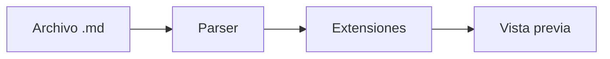

# Arquitectura del proyecto

Una base local, modular y extensible.

## Principios

- **Archivos Markdown reales.** Tus notas son tuyas, en formato abierto.
- **Lectura rápida y edición fluida.** Una experiencia nativa, sin fricción.
- **Extensiones bajo tu control.** Activa solo lo que necesitas, cuando lo necesitas.

> El visor individual abre un documento sin adjuntar su carpeta como proyecto.

## Flujo de un documento

Activa **Mermaid** desde el panel Extensiones para visualizar este diagrama:



## Componentes

| Módulo | Responsabilidad |
| --- | --- |
| Core | Documentos y proyectos |
| Render | Markdown y diagramas |
| Plugins | Funciones opcionales |

## Código

```swift
struct Documento {
    let ruta: URL
    var contenido: String
}
```

## Fórmulas opcionales

Activa Matemáticas para representar $E = mc^2$.

## Recursos locales


[Bienvenida](../bienvenida.md) · [Web externa](https://example.com)

- [x] Documentos locales
- [x] Extensiones opt-in
- [ ] Escribir mi primera nota
