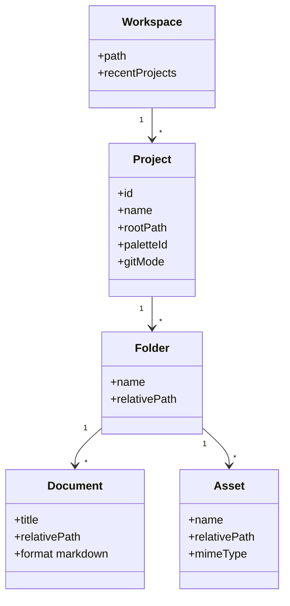

# US.000001 - Workspace local de proyectos

## Resumen

Como usuario quiero abrir LeonardoMD en un workspace local orientado a proyectos para organizar mis notas, documentos y recursos como carpetas reales del sistema de archivos.

## Contexto

LeonardoMD debe sentirse como un Notion sin IA en el arranque, pero con la filosofía local-first de Obsidian. La unidad mental principal no es una base de datos global, sino un conjunto de proyectos independientes, cada uno respaldado por carpetas y archivos Markdown reales.

## Historia de Usuario

**Como** usuario de LeonardoMD  
**quiero** crear, abrir y gestionar proyectos dentro de un workspace local  
**para** mantener documentación, notas, imágenes y recursos separados por iniciativa, cliente o producto.

## Alcance MVP

| Elemento | Incluido en MVP | Fuera de MVP |
| --- | --- | --- |
| Workspace local | Sí | Sync cloud propietario |
| Proyectos como carpetas | Sí | Bases de datos tipo Notion |
| Archivos Markdown | Sí | Formatos propietarios |
| Recursos adjuntos | Sí | Gestión avanzada DAM |
| Proyectos recientes | Sí | Búsqueda global indexada avanzada |

## Criterios de Aceptación

1. La app permite seleccionar o crear una carpeta raíz de workspace.
2. La app muestra una lista de proyectos detectados bajo el workspace.
3. Cada proyecto corresponde a una carpeta real del sistema.
4. Cada proyecto puede contener subcarpetas, archivos `.md`, imágenes y otros adjuntos.
5. El usuario puede crear, renombrar y eliminar proyectos desde la UI.
6. Las operaciones sobre proyectos se reflejan inmediatamente en el sistema de archivos.
7. La app recuerda los últimos workspaces abiertos.
8. Si un proyecto no es accesible, la app muestra un estado recuperable sin bloquear el arranque.

## Modelo Conceptual

## Notas Técnicas

- El filesystem debe ser la fuente de verdad.
- Evitar lock-in: un proyecto debe poder abrirse con Finder, VS Code, Obsidian o cualquier editor.
- Guardar metadatos mínimos en un archivo local del proyecto, por ejemplo `.leonardomd/project.json`.
- No incluir IA en esta fase.

## Riesgos

| Riesgo | Mitigación |
| --- | --- |
| Conflictos por cambios externos en disco | File watcher con refresco incremental |
| Proyectos enormes ralentizan arranque | Carga lazy del árbol y lectura bajo demanda |
| Metadatos invasivos | Mantener configuración mínima y documentada |
