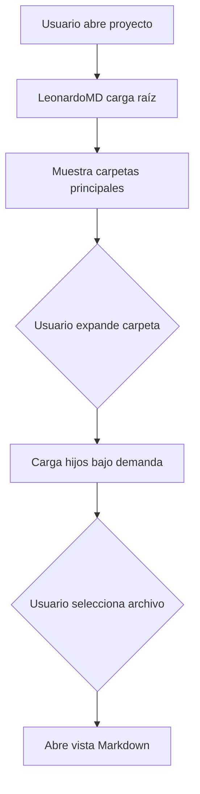

# US.000002 - Explorador de carpetas y documentos

## Resumen

Como usuario quiero navegar mis proyectos mediante un explorador de carpetas moderno para trabajar con una estructura clara, familiar y compatible con Git.

## Historia de Usuario

**Como** usuario  
**quiero** ver el árbol de carpetas y documentos de un proyecto  
**para** encontrar, crear y mover contenido sin depender de una estructura opaca.

## Alcance MVP

| Capacidad | MVP |
| --- | --- |
| Árbol de carpetas | Sí |
| Crear archivo Markdown | Sí |
| Crear carpeta | Sí |
| Renombrar | Sí |
| Mover mediante drag and drop | Deseable |
| Borrar con confirmación | Sí |
| Abrir en Finder | Sí |
| Menú contextual | Sí |

## Criterios de Aceptación

1. El usuario ve el árbol del proyecto seleccionado.
2. El árbol distingue visualmente carpetas, documentos Markdown, imágenes y otros archivos.
3. Al seleccionar un Markdown, se abre en el área principal.
4. El usuario puede crear documentos `.md` en la carpeta activa.
5. El usuario puede crear carpetas dentro del proyecto.
6. El usuario puede renombrar archivos y carpetas.
7. El usuario puede eliminar elementos con confirmación explícita.
8. La UI refleja cambios externos realizados en el sistema de archivos.
9. El árbol no bloquea la app al cargar proyectos con muchos archivos.

## Flujo Principal

## Reglas de Producto

- El explorador debe priorizar claridad y velocidad sobre decoración.
- Las carpetas ocultas como `.git` y `.leonardomd` no se muestran por defecto.
- Debe existir una opción para mostrar archivos ocultos en configuración avanzada.
- El nombre visual del documento debe derivarse del archivo, no de una base de datos separada.

## Notas Técnicas

- Usar lectura incremental del árbol.
- Mantener un índice ligero de rutas abiertas y estado expandido.
- Las operaciones de filesystem deben ser atómicas cuando sea posible.

