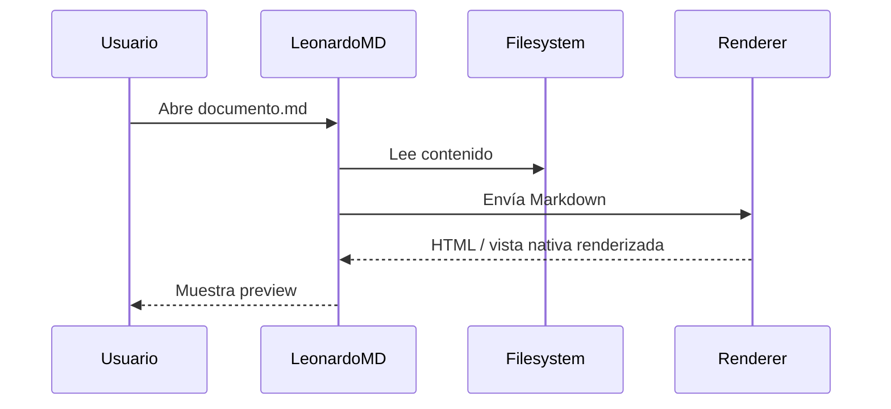

# US.000003 - Preview Markdown por defecto

## Resumen

Como usuario quiero que los Markdown se abran en modo preview por defecto para leer documentación con una presentación limpia, completa y rápida.

## Historia de Usuario

**Como** usuario  
**quiero** abrir documentos Markdown directamente en preview  
**para** consumir notas, documentación y specs sin ver el texto fuente salvo cuando quiera editar.

## Alcance MVP

| Markdown feature | MVP |
| --- | --- |
| Encabezados | Sí |
| Listas | Sí |
| Tablas | Sí |
| Imágenes locales | Sí |
| Links relativos | Sí |
| Código con resaltado | Sí |
| Mermaid | Sí |
| Task lists | Sí |
| Frontmatter | Mostrar como metadatos opcional |
| Math | No inicial |

## Criterios de Aceptación

1. Al abrir un `.md`, la vista predeterminada es preview.
2. El preview renderiza encabezados, listas, tablas, citas, código, imágenes y enlaces.
3. Las imágenes relativas al documento se muestran correctamente.
4. Los diagramas Mermaid se renderizan en el preview.
5. Las tablas se adaptan al ancho disponible sin romper el layout.
6. Los links internos relativos abren el documento destino dentro de LeonardoMD.
7. Los links externos se abren en el navegador del sistema con confirmación configurable.
8. El render inicial de documentos normales no debe ser perceptiblemente lento.

## Ejemplo de Render Soportado

## Requisitos de Rendimiento

| Métrica | Objetivo MVP |
| --- | --- |
| Apertura de documento pequeño | < 100 ms percibidos |
| Render de documento medio | < 250 ms percibidos |
| Scroll | 60 fps objetivo |
| Mermaid | Lazy render cuando el bloque entra en viewport |

## Notas Técnicas

- Evaluar renderer Markdown de alto rendimiento con soporte CommonMark/GFM.
- Mermaid puede renderizarse en un componente web aislado si la UI nativa no lo cubre bien.
- Cachear AST/render por hash de contenido para evitar recomputaciones.

