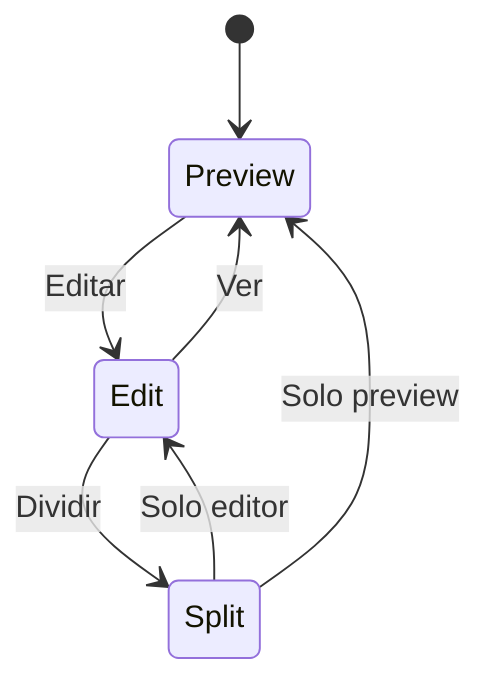

# US.000004 - Edición Markdown con cambio de modo

## Resumen

Como usuario quiero alternar entre preview, edición y vista dividida para escribir Markdown cuando lo necesite sin perder el foco de lectura.

## Historia de Usuario

**Como** usuario  
**quiero** cambiar un documento entre preview, editor y split view  
**para** leer normalmente y editar solo cuando sea necesario.

## Modos

| Modo | Descripción | MVP |
| --- | --- | --- |
| Preview | Vista renderizada por defecto | Sí |
| Edit | Editor Markdown fuente | Sí |
| Split | Editor y preview sincronizados | Sí |
| Focus | Vista sin paneles, conservando el proyecto | Sí |

## Criterios de Aceptación

1. Cada documento se abre en modo preview por defecto.
2. El usuario puede cambiar a edición desde un control visible.
3. El usuario puede volver a preview sin perder cambios.
4. La app guarda automáticamente el documento tras cambios, con debounce.
5. Si el archivo cambia externamente, la app detecta el cambio y evita sobrescribir sin avisar.
6. En split view, el scroll del editor y preview se sincroniza de forma aproximada.
7. Los cambios se reflejan en el preview sin bloquear la escritura.

## Flujo de Edición

## Notas Técnicas

- El editor debe soportar atajos estándar de macOS.
- Considerar Monaco, CodeMirror o editor nativo según stack elegido.
- El guardado debe ser robusto ante cierres inesperados.
- Evitar re-render completo en cada pulsación para documentos grandes.

## Riesgos

| Riesgo | Mitigación |
| --- | --- |
| Re-render lento mientras se escribe | Debounce, incremental rendering y cache |
| Conflictos con Git o cambios externos | Detección por mtime/hash y diálogo de resolución |
| Editor no nativo se siente pesado | Medir arranque y memoria desde el MVP |
