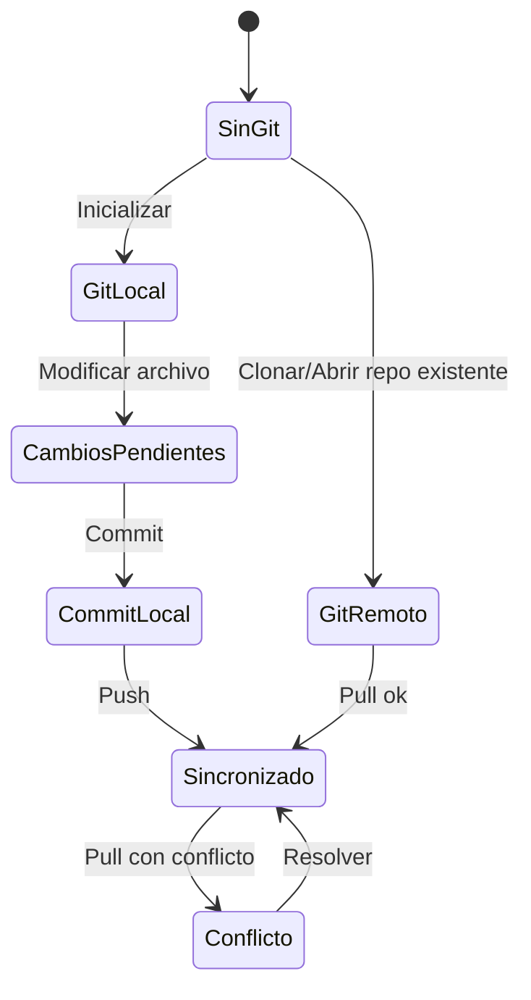

# US.000005 - Integración Git por proyecto

## Resumen

Como usuario quiero que cada proyecto pueda tener su propio repositorio Git para versionar documentación, sincronizar cambios y habilitar colaboración multiusuario.

## Historia de Usuario

**Como** usuario  
**quiero** activar Git por proyecto  
**para** versionar y sincronizar mis notas sin depender de una nube propietaria.

## Alcance MVP

| Función Git | MVP |
| --- | --- |
| Detectar repo existente | Sí |
| Inicializar repo | Sí |
| Ver estado básico | Sí |
| Stage de cambios | Sí |
| Commit | Sí |
| Pull | Sí |
| Push | Sí |
| Resolver conflictos visualmente | Post-MVP |
| Branch management avanzado | Post-MVP |

## Criterios de Aceptación

1. La app detecta si la carpeta del proyecto contiene `.git`.
2. Si no existe repo, el usuario puede inicializar Git para ese proyecto.
3. La UI muestra estado básico: limpio, cambios pendientes, ahead, behind, conflicto.
4. El usuario puede seleccionar cambios para commit.
5. El usuario puede crear un commit con mensaje.
6. El usuario puede ejecutar pull y push desde la app.
7. Los errores de autenticación o red se muestran de forma accionable.
8. Git es opcional: un proyecto puede existir sin Git.

## Estados Git

## Notas Técnicas

- La integración Git debe ser una capa aislada para poder sustituir implementación.
- Opciones a evaluar:
  - Invocar `git` CLI del sistema.
  - Usar libgit2/LibGit2Sharp si encaja con el stack.
- La UI debe evitar exponer complejidad innecesaria, pero sin ocultar estados críticos.

## Riesgos

| Riesgo | Mitigación |
| --- | --- |
| Conflictos difíciles para usuarios no técnicos | MVP detecta y guía; resolución visual queda post-MVP |
| Autenticación remota compleja | Delegar inicialmente en credenciales configuradas del sistema |
| Repos grandes lentos | Status incremental y operaciones asíncronas |
