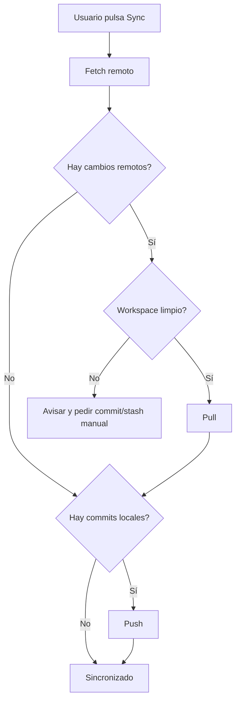

# US.000006 - Sincronización y colaboración mediante Git

## Resumen

Como equipo quiero colaborar usando repositorios Git para que la sincronización multiusuario esté basada en flujos conocidos, auditables y portables.

## Historia de Usuario

**Como** miembro de un equipo  
**quiero** sincronizar cambios mediante Git  
**para** colaborar en documentación sin un backend colaborativo propietario en el MVP.

## Alcance MVP

| Capacidad | MVP |
| --- | --- |
| Pull manual | Sí |
| Push manual | Sí |
| Indicador ahead/behind | Sí |
| Auto-fetch periódico | Deseable |
| Auto-sync completo | Post-MVP |
| Comentarios colaborativos en tiempo real | No |
| CRDT/OT | No |

## Criterios de Aceptación

1. La app puede calcular si el proyecto está ahead o behind respecto al remoto configurado.
2. El usuario puede hacer pull antes de editar o antes de push.
3. Si hay cambios locales sin commit, la app avisa antes de pull.
4. Si hay conflicto, la app identifica los archivos afectados.
5. El usuario puede abrir los archivos en conflicto desde la UI.
6. La app no intenta resolver conflictos automáticamente en MVP.
7. El historial de commits queda en el repositorio Git estándar.

## Flujo de Sync

## Decisiones de Producto

- La colaboración MVP no es tiempo real.
- Git es el mecanismo de verdad para colaboración, auditoría y reversión.
- La app debe explicar estados complejos en lenguaje claro, sin reemplazar Git.

## Métricas

| Métrica | Objetivo |
| --- | --- |
| Tiempo de estado Git en proyecto pequeño | < 300 ms percibidos |
| Operaciones Git largas | Siempre asíncronas |
| Bloqueo de UI durante pull/push | 0 |
