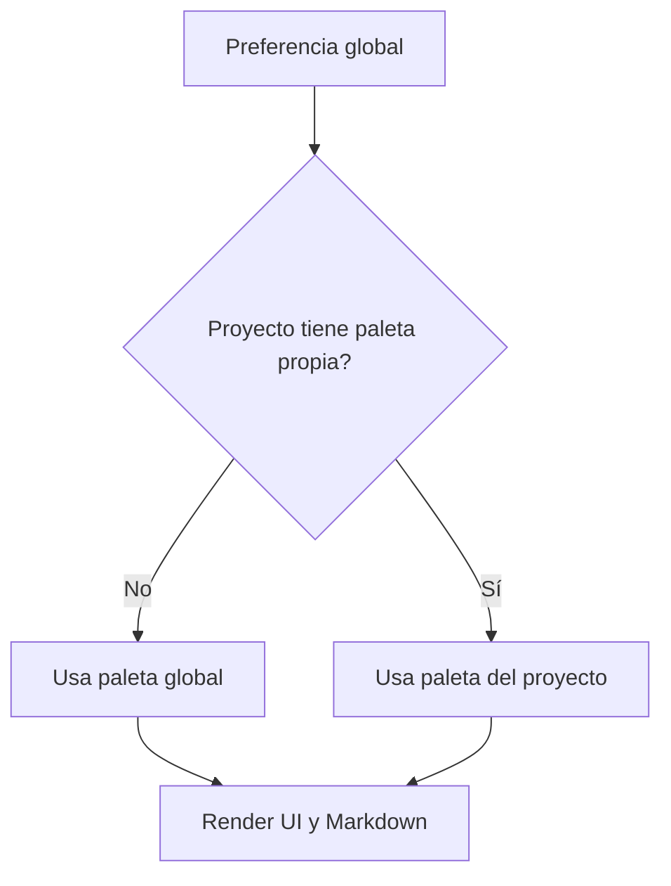

# US.000007 - Sistema de paletas globales y por proyecto

## Resumen

Como usuario quiero configurar paletas de color globales o por proyecto para adaptar LeonardoMD al contexto visual de cada trabajo.

## Historia de Usuario

**Como** usuario  
**quiero** aplicar paletas de color a nivel global y de proyecto  
**para** diferenciar espacios de trabajo y personalizar la experiencia de lectura.

## Alcance MVP

| Capacidad | MVP |
| --- | --- |
| Paleta global | Sí |
| Paleta por proyecto | Sí |
| Paletas predefinidas | Sí |
| Editor simple de paleta | Deseable |
| Import/export de paletas | Post-MVP |
| Paleta derivada automáticamente de imagen | Post-MVP |

## Criterios de Aceptación

1. El usuario puede seleccionar una paleta global.
2. Un proyecto puede heredar la paleta global.
3. Un proyecto puede sobrescribir la paleta global con una paleta propia.
4. La app aplica la paleta al shell, paneles, preview Markdown y controles principales.
5. El contraste mínimo de lectura debe ser validado por la app.
6. Las paletas se guardan como configuración portable.
7. Cambiar de paleta no requiere reiniciar la app.

## Paletas Iniciales

| Nombre | Intención | Colores clave |
| --- | --- | --- |
| Leonardo Classic | Pergamino, tinta negra, titulares rojo sangre, acento óxido | `#E7D6AD`, `#11100D`, `#7A1114`, `#A24F2A` |
| Paper White | Hoja blanca limpia | `#F8F8F5`, `#171717`, `#2B5C8A` |
| Graphite Glass | macOS moderno oscuro | `#1F2328`, `#F2F5F7`, `#6AA6B8` |

## Herencia

## Notas Técnicas

- Definir tokens semánticos, no colores directos: `surface`, `text`, `heading`, `accent`, `border`, `codeBackground`.
- Las paletas deben funcionar tanto en UI como en exportaciones futuras.
- Validar contraste para texto normal y encabezados.

