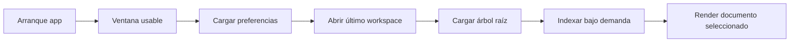

# US.000011 - Rendimiento de arranque y render

## Resumen

Como usuario quiero que LeonardoMD abra rápido y renderice Markdown de forma inmediata para que pueda usarlo como herramienta diaria sin fricción.

## Historia de Usuario

**Como** usuario  
**quiero** que la app arranque rápido y los documentos se abran sin espera perceptible  
**para** confiar en LeonardoMD como entorno principal de documentación.

## Objetivos de Rendimiento

| Métrica | Objetivo MVP |
| --- | --- |
| Cold start hasta ventana usable | < 1.2 s en Mac moderno |
| Warm start | < 500 ms |
| Abrir proyecto reciente | < 500 ms hasta árbol inicial |
| Abrir Markdown pequeño | < 100 ms percibidos |
| Abrir Markdown medio | < 250 ms percibidos |
| Scroll preview | 60 fps objetivo |
| UI bloqueada por IO | 0 eventos aceptados |

## Criterios de Aceptación

1. La app muestra ventana usable antes de cargar todo el workspace.
2. La carga de proyectos grandes es incremental.
3. El render Markdown no bloquea la interacción principal.
4. Mermaid se procesa bajo demanda o en background.
5. Las imágenes grandes se cargan con lazy loading.
6. Las operaciones Git largas se ejecutan en background.
7. Existe medición interna de tiempos clave en builds de desarrollo.
8. El equipo puede ver métricas de arranque y render durante pruebas.

## Estrategia

## Principios Técnicos

- No indexar todo el workspace en arranque.
- No renderizar Mermaid hasta que sea visible o necesario.
- Cachear resultados costosos por hash de contenido.
- Separar IO, parseo y render para poder medirlos.
- Evitar stacks con coste alto de arranque salvo que aporten una ventaja clara.

## Riesgos

| Riesgo | Mitigación |
| --- | --- |
| Renderer Markdown lento | Spike comparativo temprano |
| UI bloqueada por filesystem | Async IO y carga incremental |
| Mermaid pesado | Lazy render y cache |
| Stack multiplataforma penaliza macOS | Medición antes de decisión final |

