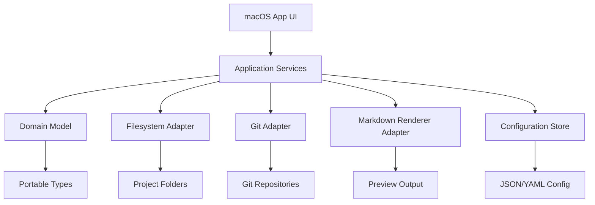

# US.000012 - Arquitectura preparada para multiplataforma

## Resumen

Como equipo de producto quiero que LeonardoMD nazca en macOS pero con arquitectura preparada para iOS, Windows y Linux, evitando reescrituras innecesarias.

## Historia de Usuario

**Como** equipo de desarrollo  
**quiero** separar dominio, persistencia, Git, render y UI  
**para** aprovechar el desarrollo inicial de macOS en futuras plataformas.

## Alcance MVP

| Área | Objetivo |
| --- | --- |
| Dominio | Portable |
| Configuración | Portable |
| Integración Git | Interfaz abstracta |
| Render Markdown | Sustituible |
| UI macOS | Nativa o muy integrada |
| iOS/Windows/Linux | Preparado, no implementado |

## Criterios de Aceptación

1. El dominio de workspace, proyecto, documento, paleta y configuración no depende de UI.
2. La integración Git se consume mediante interfaz.
3. El render Markdown se consume mediante interfaz o módulo aislado.
4. Las preferencias se guardan en formatos portables.
5. La estructura de proyecto en disco es compatible entre plataformas.
6. No se introducen dependencias macOS-only fuera de la capa de aplicación macOS.
7. Las decisiones técnicas quedan documentadas en ADRs cuando empiece la implementación.

## Arquitectura Objetivo

## Decisiones Pendientes

| Decisión | Cuándo resolver |
| --- | --- |
| SwiftUI vs Avalonia vs Tauri | Spike inicial |
| Renderer Markdown principal | Spike inicial |
| Mermaid integrado o componente aislado | Spike inicial |
| Formato de configuración | Antes del primer proyecto real |
| Política de plugins | Post-MVP |

## Reglas de Ingeniería

- Duplicidad de código cero como criterio de revisión.
- Preferir contratos claros a acoplamientos implícitos.
- Mantener módulos pequeños, testeables y sustituibles.
- No introducir IA en el core MVP.
- Preparar specs SDD a partir de estas US antes de implementar features grandes.

