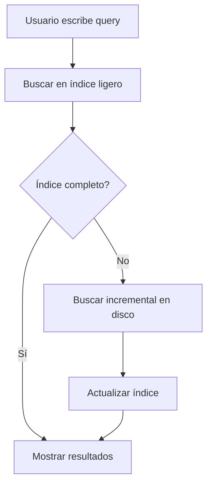

# US.000013 - Búsqueda local en proyecto

## Resumen

Como usuario quiero buscar contenido dentro de un proyecto para encontrar notas, specs y referencias sin depender de servicios externos.

## Historia de Usuario

**Como** usuario  
**quiero** buscar por nombre de archivo y texto dentro del proyecto  
**para** navegar documentación grande de forma rápida.

## Alcance MVP

| Búsqueda | MVP |
| --- | --- |
| Por nombre de archivo | Sí |
| Por contenido Markdown | Sí |
| Por encabezados | Deseable |
| Filtros por carpeta | Deseable |
| Búsqueda global multi-workspace | No |
| Búsqueda semántica/IA | No |

## Criterios de Aceptación

1. El usuario puede abrir una búsqueda dentro del proyecto activo.
2. La búsqueda devuelve archivos por nombre.
3. La búsqueda devuelve coincidencias dentro de Markdown.
4. Los resultados muestran archivo, ruta y fragmento.
5. Al seleccionar un resultado, se abre el documento en la ubicación aproximada.
6. La búsqueda no bloquea la UI.
7. La indexación inicial es incremental.
8. La búsqueda respeta carpetas ignoradas como `.git`.

## Flujo

## Notas Técnicas

- Empezar con búsqueda local simple antes de indexadores complejos.
- Evaluar SQLite FTS, Tantivy, Lucene.NET o índice propio según stack.
- No usar IA ni embeddings en MVP.

