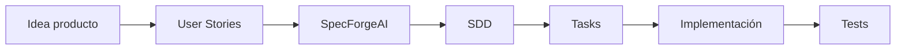

# US.000015 - Preparación para SDD con SpecForgeAI

## Resumen

Como equipo quiero que las User Stories de LeonardoMD estén escritas de forma estructurada para poder convertirlas en specs SDD usando SpecForgeAI.

## Historia de Usuario

**Como** equipo de desarrollo  
**quiero** documentar cada US en archivos Markdown homogéneos  
**para** alimentar un flujo posterior de especificación detallada, diseño y tareas.

## Convención Inicial

| Elemento | Convención |
| --- | --- |
| Carpeta | `doc/US/` |
| Archivo | `us.xxxxxx.md` |
| ID | `US.xxxxxx` |
| Formato | Markdown |
| Diagramas | Mermaid cuando aporte claridad |
| Tablas | Para alcance, criterios, riesgos y decisiones |

## Criterios de Aceptación

1. Cada User Story vive en un archivo independiente.
2. El nombre del archivo usa formato `us.xxxxxx.md`.
3. Cada archivo incluye resumen, historia, alcance y criterios de aceptación.
4. Las US técnicas incluyen notas técnicas y riesgos.
5. Las relaciones complejas se expresan con Mermaid cuando mejora la comprensión.
6. Las US no dependen de IA para ejecutarse en MVP.
7. Las US están listas para ser promovidas a SDD sin reescritura completa.

## Flujo Esperado

## Reglas de Calidad

- Cada US debe tener valor de usuario o valor técnico explícito.
- Evitar mezclar demasiadas capacidades en una sola US.
- Los criterios de aceptación deben ser verificables.
- Las decisiones no cerradas deben quedar visibles como pendientes o spikes.
- Las specs futuras deben conservar el enfoque clean code y cero duplicidad.

