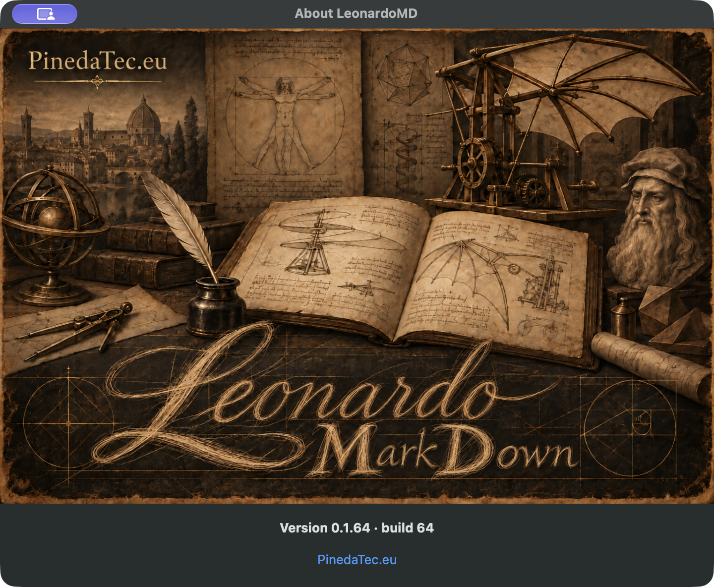

# PR54 author-owned runtime evidence

Source SHA: `5772afca28e7a214c5258e71527d66c86b349677`.

Captured from `/Applications/LeonardoMD.app` after packaging that source and installing with `ditto`. About visibly shows `Version 0.1.64 · build 64`; canonical `version.nfo`, `CFBundleShortVersionString` and `CFBundleVersion` agree. Channel remains internal beta metadata; the visible version has no maturity suffix.

Environment: macOS27.0.1 (26A434), English locale, empty document. Native `About LeonardoMD` window720×592 points; capture1440×1184 pixels with native window-shadow exclusion. Browser, URL, route: N/A. CUA opens About and confirms its accessibility text. The owner-authorized native fallback uses `screencapture -x -o -l` against verified installed-app PID46881/window38788. Screenshot is unaltered and contains no user documents.

Reproduce from exact source: `LEONARDO_SOURCE_PR=54 ./scripts/build-app.sh`, or the complete `scripts/prepare-release.sh` flow with `LEONARDO_SOURCE_PR=54 LEONARDO_VERSION=0.1.64 LEONARDO_BUILD=64 LEONARDO_CHANNEL=beta LEONARDO_NOTARIZE=0`, configured public Sparkle key, beta Keychain account, Developer ID identity and a nonempty release notes file. Use a fresh output assets directory. Successful source compilation must be recorded by the repository wrapper, not bypassed. Install signed output, launch it and choose **LeonardoMD → About LeonardoMD**. Credentials stay in Keychain.

Installed and source-packaged executable SHA256 both equal:
`eb5c3a547e3398bad33a4e7bd4e690bc8f96ee3072c732da1222f45c70bcccc0`.

The attached generated `appcast.xml` is local packaging evidence: numeric tag/version, `leonardo:channel="beta"`, exactly one `sparkle:channel=beta`, and a real Ed25519 archive signature verified by packaging. It is not a published feed. The internal Leonardo marker is a publication invariant, not an XML cryptographic signature; existing embedded-key/archive authentication remains required.

Signed app, archive, appcast and regenerated signed DMG are preserved at local `output/pr54-0.1.64/`; checksum and signatures verify. Previous local candidate is preserved at `output/pr54-initial-0.1.64/`. Local candidate is not notarized. No public release/tag/feed is published by this evidence branch or source PR.

The evidence branch starts at the full reviewed source SHA and changes only evidence; it does not modify the source commit.
