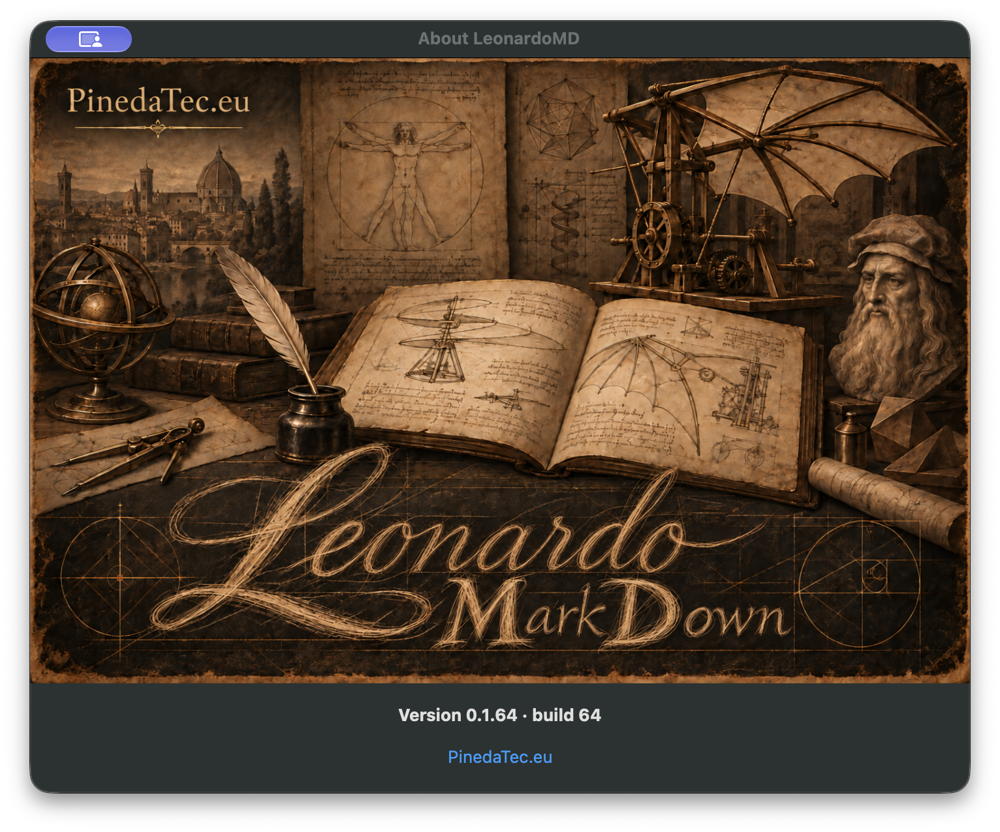

# PR54 author-owned runtime evidence

Source SHA: `bd34a9713934b7b2185c1f645e4246388ce830ee`.

Captured from `/Applications/LeonardoMD.app` after packaging that source and installing it with `ditto`. About visibly displays `Version 0.1.64 · build 64`; `version.nfo` is `0.1.64`, `CFBundleShortVersionString=0.1.64`, `CFBundleVersion=64`. Internal update channel remains beta; there is no channel suffix in the displayed version.

Environment: macOS 27.0.1 (26A434). Native SwiftUI window `About LeonardoMD`, 720×592 points, screenshot 1534×1278 pixels including window shadow. Browser/URL/route: N/A, native app. State: empty document, English locale, About dialog. No user documents appear.

Reproduction: checkout the exact source SHA, run the repository `scripts/build-app.sh` with `LEONARDO_SOURCE_PR=54` (a successful source compilation must be recorded in the ledger), then package with `scripts/prepare-release.sh` using channel beta, numeric version 0.1.64 and build64, and the configured beta Sparkle Keychain account. Install the signed output app into `/Applications`, launch it, then choose **LeonardoMD → About LeonardoMD**. Signing credentials remain in Keychain. This is a local signed, non-notarized preview, not a published release.

Capture: CUA opened About and its accessibility tree confirmed the numeric version. Its screenshot returned a Stage Manager thumbnail, so the owner's previously authorized native capture fallback was used: `screencapture -x -l` against the verified About window belonging to installed-app PID23434, window38666. The displayed image is unaltered.

Installed and packaged executable SHA256 match:
`daa886b7167326c343c12a4ee076ee2e47af81c7d023345cc8b01141c4e4c906`.

The evidence branch adds only this capture/provenance; it does not change the reviewed source SHA. Signed app/ZIP/appcast are preserved outside the source worktree at local `output/pr54-0.1.64/`. A signed DMG is regenerated from that app for the owner.
