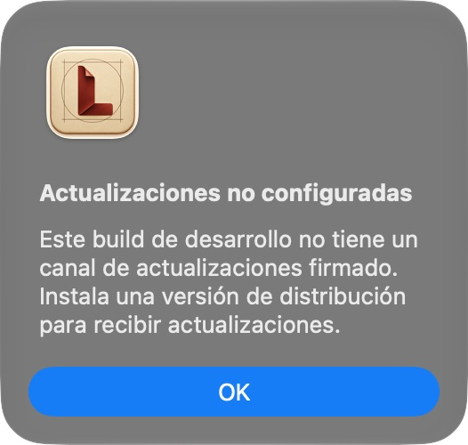

# Native update UI evidence

Captured 2026-10-07 on macOS, arm64, from the packaged app built from implementation commit `5951ea4f8ddc1b1ca38deb24232e7e2d8829bca1`. The subsequent evidence-only commit does not change runtime code. Image size is the native screenshot size.

CUA accessibility inspection verified **LeonardoMD → Buscar actualizaciones…**, disabled **Comprobar actualizaciones automáticamente** for a bundle without `SUPublicEDKey`, and the displayed explanatory dialog. No signed distribution key or release was used. This capture proves development-mode feedback, not an installed update. Signed-release acceptance is described in `../../releases.md` and remains pending.
